# Out-Run App Architecture

## System Architecture Diagram

```mermaid
graph TB
    subgraph "🌐 User's Mobile Device"
        MobileBrowser["📱 Mobile Browser<br/>(PWA Ready)"]
        GPS["📍 GPS API<br/>(Geolocation)"]
    end

    subgraph "☁️ Vercel Deployment"
        subgraph "Next.js App Router (SSR-Safe)"
            RootLayout["📄 Root Layout<br/>(Server Component)"]
            ClientLayout["🔧 ClientLayout<br/>(Mounted Check)"]
            
            subgraph "Client Pages (force-dynamic)"
                MapPage["🗺️ /map<br/>(Dynamic Import)"]
                RunPage["🏃 /run<br/>(Dynamic Import)"]
                HomePage["🏠 /home"]
                AdminPages["⚙️ /admin/*<br/>(32 Dynamic Routes)"]
            end
        end
    end

    subgraph "🎨 UI Components (Client-Side Only)"
        AppMap["🗺️ AppMap<br/>(Mapbox GL)"]
        ActiveDashboard["📊 ActiveDashboard<br/>(Workout UI)"]
        FreeRunView["🏃 FreeRunView<br/>(Real-time Stats)"]
        BottomNav["🧭 BottomNavigation"]
    end

    subgraph "💾 Zustand State Management (SSR-Safe)"
        UserStore["👤 useUserStore<br/>(Profile, Onboarding)<br/>skipHydration: SSR"]
        AppStore["🌐 useAppStore<br/>(i18n, Language)<br/>Safe Storage"]
        SessionStore["⏱️ useSessionStore<br/>(Duration, Distance, Calories)"]
        RunningStore["🏃 useRunningPlayer<br/>(Pace, Laps, Route)"]
        MapStore["🗺️ useMapStore<br/>(Routes, Location)"]
    end

    subgraph "🔧 Services & APIs"
        MapboxService["🗺️ Mapbox Service<br/>(Hebrew RTL Support)<br/>typeof window check"]
        LocationService["📍 Location Service<br/>(GPS Tracking)"]
        WorkoutEngine["⚡ Workout Engine<br/>(Real-time Calculations)"]
        FirestoreService["🔥 Firestore<br/>(User Data, Workouts)"]
    end

    subgraph "📦 Persistence Layer"
        LocalStorage["💾 localStorage<br/>(Browser Only)<br/>Custom Storage Wrapper"]
        SessionStorage["📝 sessionStorage<br/>(Onboarding State)"]
    end

    %% User Flow
    MobileBrowser -->|"HTTPS Request"| RootLayout
    RootLayout -->|"SSR-Safe Wrapper"| ClientLayout
    ClientLayout -->|"Mounted Check"| MapPage
    ClientLayout -->|"Mounted Check"| RunPage
    ClientLayout -->|"Mounted Check"| HomePage
    ClientLayout -->|"Mounted Check"| AdminPages

    %% Component Rendering
    MapPage -->|"Dynamic Import<br/>(ssr: false)"| AppMap
    RunPage -->|"Renders"| ActiveDashboard
    ActiveDashboard -->|"Dispatches"| FreeRunView
    ClientLayout -->|"Conditional Render"| BottomNav

    %% State Management Flow
    AppMap -->|"Updates"| MapStore
    AppMap -->|"Reads"| UserStore
    FreeRunView -->|"Updates"| RunningStore
    FreeRunView -->|"Reads"| SessionStore
    ActiveDashboard -->|"Reads"| SessionStore
    ActiveDashboard -->|"Reads"| RunningStore

    %% Service Integration
    AppMap -->|"Uses"| MapboxService
    MapboxService -->|"Checks"| MapStore
    LocationService -->|"GPS Updates"| MapStore
    LocationService -->|"GPS Updates"| RunningStore
    WorkoutEngine -->|"Calculates"| SessionStore
    WorkoutEngine -->|"Calculates"| RunningStore

    %% Data Persistence
    UserStore -->|"Persists"| LocalStorage
    AppStore -->|"Persists"| LocalStorage
    MapStore -->|"Temporary"| SessionStorage

    %% External Services
    LocationService -->|"Reads"| GPS
    WorkoutEngine -->|"Saves"| FirestoreService
    UserStore -->|"Syncs"| FirestoreService

    %% SSR Protection
    ClientLayout -.->|"typeof window !== 'undefined'"| LocalStorage
    MapboxService -.->|"typeof window !== 'undefined'"| MobileBrowser
    UserStore -.->|"skipHydration: SSR"| LocalStorage

    style MobileBrowser fill:#4CAF50,color:#fff
    style RootLayout fill:#2196F3,color:#fff
    style ClientLayout fill:#FF9800,color:#fff
    style UserStore fill:#9C27B0,color:#fff
    style MapboxService fill:#F44336,color:#fff
    style WorkoutEngine fill:#00BCD4,color:#fff
    style LocalStorage fill:#795548,color:#fff
```

## Key Architecture Patterns

### 1. SSR-Safe Architecture
- **Root Layout**: Server Component (no browser APIs)
- **ClientLayout**: Client Component with `mounted` check
- **All Pages**: `export const dynamic = 'force-dynamic'` to skip static generation
- **Dynamic Imports**: Mapbox components use `dynamic()` with `ssr: false`

### 2. State Management (Zustand)
- **UserStore**: Profile, onboarding state (with `skipHydration` for SSR)
- **AppStore**: i18n, language (with safe storage wrapper)
- **SessionStore**: Workout metrics (duration, distance, calories)
- **RunningStore**: Running-specific state (pace, laps, route)
- **MapStore**: Map state (routes, location, viewport)

### 3. Service Layer
- **MapboxService**: Hebrew RTL support, `typeof window` guards
- **LocationService**: GPS tracking, updates stores in real-time
- **WorkoutEngine**: Calculates pace, distance, calories from GPS data
- **FirestoreService**: Persists workouts, syncs user data

### 4. Data Flow
1. **User opens app** → Root Layout (SSR)
2. **ClientLayout mounts** → Checks `typeof window !== 'undefined'`
3. **Pages render** → Force dynamic (no prerendering)
4. **Components load** → Dynamic imports for Mapbox
5. **Stores hydrate** → Skip hydration during SSR, load from localStorage on client
6. **GPS starts** → LocationService updates MapStore & RunningStore
7. **Workout active** → WorkoutEngine calculates metrics → Updates SessionStore
8. **UI updates** → Components read from stores → Real-time display

### 5. Mobile Deployment Strategy
- **Vercel**: Production deployment (Next.js optimized)
- **PWA Ready**: Service worker, offline support
- **App Stores**: Targeting React Native wrapper or Capacitor

## SSR Protection Mechanisms

1. **Layout Level**: `ClientLayout` with mounted check
2. **Page Level**: `export const dynamic = 'force-dynamic'`
3. **Component Level**: Dynamic imports with `ssr: false`
4. **Store Level**: `skipHydration: typeof window === 'undefined'`
5. **Service Level**: `typeof window !== 'undefined'` guards
6. **Storage Level**: Custom storage wrapper with SSR checks
