```mermaid
flowchart TD
    HomePage[Home Dashboard] -->|User Profile| HomeWorkoutService[home-workout.service.ts]
    
    HomeWorkoutService -->|Fetch| ExerciseDB[(Exercise DB)]
    HomeWorkoutService -->|Fetch| GymEquipmentDB[(Gym Equipment DB)]
    HomeWorkoutService -->|Fetch| ParkDB[(Park DB - if at park)]
    
    HomeWorkoutService -->|Build Context| ContextBuilder[Context Builder Module]
    ContextBuilder -->|Calculate| DaysInactive[Calculate Days Inactive]
    ContextBuilder -->|Map| PersonaMapper[Persona Mapper]
    ContextBuilder -->|Extract| EquipmentExtractor[Equipment Extractor]
    ContextBuilder -->|Build| InjuryShield[Injury Shield List]
    
    ContextBuilder -->|Stage 1 Context| ContextualEngine[ContextualEngine]
    
    ContextualEngine -->|Hard Filters| InjuryFilter[Injury Shield Filter]
    ContextualEngine -->|Hard Filters| LocationFilter[Location/Sweat/Noise Filter]
    ContextualEngine -->|Hard Filters| FieldMode[Field Mode Filter]
    ContextualEngine -->|Method Selection| ExecutionMethodSelector[ExecutionMethod Selector]
    
    ExecutionMethodSelector -->|Priority 1| BrandMatching[Brand Matching - Park Only]
    ExecutionMethodSelector -->|Priority 2| EquipmentIDMatch[Equipment ID Match]
    ExecutionMethodSelector -->|Priority 3| UserGearMatch[User Gear Match]
    ExecutionMethodSelector -->|Priority 4| ImprovisedFallback[Improvised Fallback]
    
    ContextualEngine -->|Scoring| LifestyleScore[Lifestyle Match +2/tag]
    ContextualEngine -->|Scoring| LevelProximity[Level Proximity +3 exact]
    ContextualEngine -->|Scoring| BlastBonus[Blast Mode Bonus]
    ContextualEngine -->|Scoring| VideoBonus[Video Bonus +1]
    
    ContextualEngine -->|Balancing| SABABalancer[SA/BA Balancer]
    SABABalancer -->|Limit| MaxSA[Max 2 SA per session]
    SABABalancer -->|Penalty| SAExcessPenalty[-5 per excess SA]
    
    ContextualEngine -->|Scored Exercises| WorkoutGenerator[WorkoutGenerator]
    
    WorkoutGenerator -->|Difficulty Filter| DifficultySelector[Difficulty-Based Selection]
    WorkoutGenerator -->|Exercise Count| DurationScaler[Duration-Based Count]
    WorkoutGenerator -->|Volume Calc| VolumeAdjuster[Volume Adjustment]
    
    VolumeAdjuster -->|Check| InactivityCheck{Days > 3?}
    InactivityCheck -->|YES| ReactivationProtocol[Reactivation: -40% Sets]
    InactivityCheck -->|NO| NormalVolume[Normal Volume]
    
    WorkoutGenerator -->|Rest Calculation| RestTimerCalc[Dynamic Rest Timer]
    RestTimerCalc -->|1-5 reps| LongRest[180s - Heavy Strength]
    RestTimerCalc -->|6-12 reps| MediumRest[90s - Hypertrophy]
    RestTimerCalc -->|12+ reps| ShortRest[45s - Accessory]
    
    WorkoutGenerator -->|Final Workout| GeneratedWorkout[GeneratedWorkout Object]
    GeneratedWorkout -->|Return| HomeWorkoutService
    HomeWorkoutService -->|Display| HeroWorkoutCard[Hero Workout Card]
    HeroWorkoutCard -->|User Action| AdjustModal[Adjust Workout Modal]
    AdjustModal -->|Regenerate| HomeWorkoutService
```

# Home Workout Service: Professional Engine Architecture (REVISED)

**Document Purpose:** Complete technical architecture for implementing a Professional-Grade Workout Generation Service that integrates the existing ContextualEngine and WorkoutGenerator with the Home Dashboard.

**Source of Truth:** `TRAINING_LOGIC.md`  
**Date:** 2026-02-09  
**Status:** Architecture Phase - Awaiting Approval

---

## 🎯 Executive Summary

This document outlines the implementation of a **Production-Ready Workout Generation Service** for the Home Dashboard that integrates:

1. **Advanced Selection Engine** (4-Level Priority): Brand → Location → Persona → Gear Type
2. **Injury Shield** with zero-score enforcement
3. **Shadow Tracking** with per-muscle-group levels
4. **SA/BA Balance** enforcement (max 2 straight-arm per session)
5. **Reactivation Protocol** (40% volume reduction after 3+ days)
6. **Dynamic Rest Timers** pulled from exercise metadata
7. **Super-Adjuster Testing Modal** for dev testing

---

## 📐 System Architecture Overview



---

## 🏗️ Part 1: Advanced Selection Engine (4-Level Priority)

### 1.1 The Priority Cascade

The engine selects the optimal `ExecutionMethod` for each exercise using a **4-level priority cascade**:

```
Priority 1: Brand Matching (Park Only)
  ↓ (if no match)
Priority 2: Equipment ID Match (Fixed Equipment)
  ↓ (if no match)
Priority 3: User Gear Match (Personal Equipment)
  ↓ (if no match)
Priority 4: Improvised Method (Bodyweight/Household Items)
```

### 1.2 Implementation: ExecutionMethod Selector

**Location:** Already exists at `src/features/workout-engine/generator/services/execution-method-selector.service.ts`

**Function:** `selectExecutionMethodWithBrand()`

**Priority 1: Brand Matching (Lines 52-98)**
```typescript
// At park: Try to find exact brand match
if (location === 'park' && park && park.gymEquipment) {
  for (const method of locationMethods) {
    if (method.requiredGearType === 'fixed_equipment') {
      const parkEquipment = park.gymEquipment.find(
        (eq) => eq.equipmentId === method.equipmentId
      );
      
      if (parkEquipment) {
        const equipmentDef = gymEquipmentList.find((eq) => eq.id === method.equipmentId);
        
        // Check if park's brand matches
        const brandMatch = equipmentDef.brands.find(
          (brand) => brand.brandName === parkEquipment.brandName
        );
        
        // If brand matches, return method with brand-specific video
        if (brandMatch && brandMatch.videoUrl) {
          return {
            ...method,
            media: {
              ...method.media,
              mainVideoUrl: brandMatch.videoUrl,  // ✅ Brand-specific video
            },
          };
        }
      }
    }
  }
}
```

**Priority 2-4: Standard Fallback (Lines 102-144)**
```typescript
let priorityOrder: RequiredGearType[];
if (location === 'home' || location === 'office') {
  priorityOrder = ['user_gear', 'improvised'];
} else if (location === 'park' || location === 'gym') {
  priorityOrder = ['fixed_equipment', 'user_gear', 'improvised'];
} else {
  priorityOrder = ['user_gear', 'improvised'];
}

// Try each priority in order
for (const gearType of priorityOrder) {
  const methodsOfType = locationMethods.filter((m) => m.requiredGearType === gearType);
  // ... check user gear availability, return first match
}
```

### 1.3 Integration into home-workout.service.ts

**Step 1.3.1:** Import the selector
```typescript
import { selectExecutionMethodWithBrand } from '@/features/workout-engine/generator/services/execution-method-selector.service';
```

**Step 1.3.2:** Fetch park data if at park location
```typescript
/**
 * Fetch park data if user is at a park location
 */
async function fetchParkDataIfNeeded(
  location: ExecutionLocation,
  userProfile: UserFullProfile
): Promise<Park | null> {
  if (location !== 'park') {
    return null;
  }
  
  // TODO: Determine which park user is at
  // Options:
  // 1. Use user's last visited park from profile
  // 2. Use GPS coordinates to find nearest park
  // 3. Let user select park in AdjustWorkoutModal
  
  // For now, return null (fallback to generic park methods)
  return null;
}
```

**Step 1.3.3:** Use selector in ContextualEngine call
```typescript
// Build context for ContextualEngine
const park = await fetchParkDataIfNeeded(context.location, userProfile);

// ContextualEngine will internally call selectExecutionMethodWithBrand
// We don't call it directly - the engine handles it during filtering
```

**Math Example: Brand Matching Priority**
```
Scenario: User at "Gan Meir Park" with "Kompan" pull-up bar

Exercise: "Pull-ups"
Available ExecutionMethods:
1. Method A: fixed_equipment, equipmentId: "pull_up_bar_high", requiredGearType: 'fixed_equipment'
2. Method B: user_gear, gearId: "resistance_bands", requiredGearType: 'user_gear'
3. Method C: improvised, gearId: "tree_branch", requiredGearType: 'improvised'

Priority Cascade:
1. Check Method A (fixed_equipment):
   - Park has pull_up_bar_high: YES
   - Park's pull_up_bar_high brandName: "Kompan"
   - Equipment definition has brand "Kompan": YES
   - Brand "Kompan" has videoUrl: "https://.../kompan_pullup.mp4"
   → SELECT Method A with Kompan-specific video ✅

Result: User sees exercise demo filmed on the EXACT equipment brand they're using
```

---

## 🛡️ Part 2: Injury Shield & Contextual Filters

### 2.1 Injury Shield: Zero-Score Enforcement

**Current Implementation:** Already exists in `ContextualEngine.ts` (lines 262-266)

```typescript
// Injury Shield filter (HARD FILTER - completely excludes exercises)
if (!this.passesInjuryShield(exercise, context.injuryShield)) {
  excludedCount++;
  continue;  // ✅ Exercise is EXCLUDED, not just scored low
}

// Implementation (lines 438-447)
private passesInjuryShield(
  exercise: Exercise,
  userInjuries: InjuryShieldArea[]
): boolean {
  if (!userInjuries.length) return true;
  if (!exercise.injuryShield?.length) return true;
  
  // Exclude if ANY overlap between exercise stress areas and user injuries
  return !exercise.injuryShield.some(area => userInjuries.includes(area));
}
```

**Math Example: Injury Shield Filtering**
```
User Injury Profile:
- injuries: ['wrist', 'elbow']

Exercise Library:
1. "Push-ups" (injuryShield: ['wrist', 'elbow', 'shoulder'])
   → Overlap: ['wrist', 'elbow']
   → passesInjuryShield() = FALSE
   → Exercise EXCLUDED ❌ (score not even calculated)

2. "Squats" (injuryShield: ['knee', 'ankle'])
   → Overlap: none
   → passesInjuryShield() = TRUE
   → Exercise CONTINUES to scoring ✅

3. "Plank" (injuryShield: [])
   → No stress areas defined
   → passesInjuryShield() = TRUE
   → Exercise CONTINUES to scoring ✅

Result: Zero exercises with wrist/elbow stress in final workout
```

### 2.2 Office/Parent Mode: Sweat & Noise Filtering

**Current Implementation:** Already exists in `ContextualEngine.ts` (lines 284-299)

```typescript
// Environment constraints (sweat/noise)
if (!constraints.bypassLimits) {
  // Sweat limit (ignore in blast mode)
  if (context.intentMode !== 'blast') {
    const effectiveSweatLimit = context.intentMode === 'on_the_way' ? 1 : constraints.sweatLimit;
    if (exercise.sweatLevel && exercise.sweatLevel > effectiveSweatLimit) {
      excludedCount++;
      continue;  // ✅ HARD FILTER
    }
  }
  
  // Noise limit
  if (exercise.noiseLevel && exercise.noiseLevel > constraints.noiseLimit) {
    excludedCount++;
    continue;  // ✅ HARD FILTER
  }
}
```

**Location Constraints (lines 113-193)**
```typescript
const LOCATION_CONSTRAINTS: Record<ExecutionLocation, LocationConstraints> = {
  office: {
    sweatLimit: 1,   // ✅ Low sweat only
    noiseLimit: 1,   // ✅ Silent exercises only
    methodPriority: 3,
    bypassLimits: false,
  },
  home: {
    sweatLimit: 3,   // ✅ Any sweat level allowed
    noiseLimit: 2,   // ✅ Moderate noise OK
    methodPriority: 2,
    bypassLimits: false,
  },
  park: {
    sweatLimit: 3,
    noiseLimit: 3,
    methodPriority: 1,
    bypassLimits: true,  // ✅ Park bypasses limits (uses facility mapping instead)
  },
  // ... other locations
};
```

**Math Example: Office Mode Filtering**
```
Context:
- Location: 'office'
- Persona: 'office_worker'
- Duration: 15 minutes

Location Constraints for 'office':
- sweatLimit: 1
- noiseLimit: 1

Exercise Library:
1. "Burpees" (sweatLevel: 3, noiseLevel: 3)
   → sweatLevel 3 > limit 1: FAIL
   → Exercise EXCLUDED ❌

2. "Jumping Jacks" (sweatLevel: 2, noiseLevel: 2)
   → sweatLevel 2 > limit 1: FAIL
   → Exercise EXCLUDED ❌

3. "Seated Core Twist" (sweatLevel: 1, noiseLevel: 1)
   → sweatLevel 1 <= limit 1: PASS ✅
   → noiseLevel 1 <= limit 1: PASS ✅
   → Exercise CONTINUES to scoring

4. "Standing Stretch" (sweatLevel: 1, noiseLevel: 1)
   → Both constraints pass
   → Exercise CONTINUES to scoring

Result: Only low-sweat, silent exercises in office workout
```

### 2.3 Integration: Extract Injury Shield from UserProfile

**Step 2.3.1:** Create injury extractor in home-workout.service.ts
```typescript
/**
 * Extract injury areas from user health profile
 * Maps to InjuryShieldArea enum used by ContextualEngine
 */
function extractInjuryShield(userProfile: UserFullProfile): InjuryShieldArea[] {
  return userProfile.health?.injuries || [];
}
```

**Step 2.3.2:** Pass to ContextualEngine
```typescript
const engineContext: ContextualFilterContext = {
  location: context.location,
  lifestyles: context.lifestyles,
  injuryShield: extractInjuryShield(userProfile),  // ✅ From user profile
  intentMode: context.intentMode,
  availableEquipment: context.availableEquipment,
  userLevel: context.userLevel,
  levelTolerance: 3,
};
```

---

## 🧠 Part 3: Shadow Tracking & Bio-Mechanics

### 3.1 Shadow Tracking: Per-Muscle-Group Level Mapping

**Problem:** User sees "Full Body Program - Level 10" but system needs:
- Push strength: Level 12
- Pull strength: Level 8
- Legs: Level 4

**Solution:** Map `exercise.movementGroup` → domain level

**Step 3.1.1:** Create shadow tracking mapper
```typescript
/**
 * Shadow Tracking: Get effective level for specific exercise
 * Uses exercise's movementGroup to pull the correct domain level
 * Implements TRAINING_LOGIC.md Rule 2.2
 */
function getEffectiveLevelForExercise(
  exercise: Exercise,
  userProfile: UserFullProfile
): number {
  const movementGroup = exercise.movementGroup;
  const domains = userProfile.progression.domains;
  
  // Map movement groups to domain levels
  switch (movementGroup) {
    // PUSH movements → upper_body level
    case 'horizontal_push':  // Push-ups, Dips, Bench Press
    case 'vertical_push':    // Handstand Push-ups, Overhead Press
      return domains.upper_body?.currentLevel || 1;
    
    // PULL movements → upper_body level (same domain, different tracking)
    case 'horizontal_pull':  // Rows, Inverted Rows
    case 'vertical_pull':    // Pull-ups, Chin-ups
      return domains.upper_body?.currentLevel || 1;
    
    // LEGS movements → lower_body level
    case 'squat':           // Squats, Pistol Squats, Lunges
    case 'hinge':           // Deadlifts, Romanian DL, Single-leg RDL
      return domains.lower_body?.currentLevel || 1;
    
    // CORE movements → core level
    case 'core':            // Planks, L-sits, Hollow Body, Dragon Flag
      return domains.core?.currentLevel || 1;
    
    // ISOLATION movements → use compound level of primary muscle
    case 'isolation':
      // Map primary muscle to domain
      const primaryMuscle = exercise.primaryMuscle;
      if (primaryMuscle === 'biceps' || primaryMuscle === 'triceps' || primaryMuscle === 'lats') {
        return domains.upper_body?.currentLevel || 1;
      }
      if (primaryMuscle === 'quads' || primaryMuscle === 'glutes' || primaryMuscle === 'hamstrings') {
        return domains.lower_body?.currentLevel || 1;
      }
      return domains.full_body?.currentLevel || domains.upper_body?.currentLevel || 1;
    
    // DEFAULT fallback
    default:
      return domains.full_body?.currentLevel || domains.upper_body?.currentLevel || 1;
  }
}
```

**Step 3.1.2:** Modify ContextualEngine to accept per-exercise level callback

**REQUIRED INTERFACE CHANGE:** `ContextualEngine.ts` line 94

**BEFORE:**
```typescript
export interface ContextualFilterContext {
  // ...
  userLevel: number;  // ❌ Single global level
  // ...
}
```

**AFTER:**
```typescript
export interface ContextualFilterContext {
  // ...
  getUserLevelForExercise: (exercise: Exercise) => number;  // ✅ Per-exercise callback
  // ...
}
```

**Step 3.1.3:** Update ContextualEngine scoring logic

**File:** `ContextualEngine.ts` (lines 520-524)

**BEFORE:**
```typescript
// Level Proximity scoring
const exerciseLevel = this.getExerciseLevel(exercise);
const levelDiff = Math.abs(exerciseLevel - context.userLevel);  // ❌ Global level
const levelScore = Math.max(0, 3 - levelDiff);
```

**AFTER:**
```typescript
// Level Proximity scoring
const exerciseLevel = this.getExerciseLevel(exercise);
const userEffectiveLevel = context.getUserLevelForExercise(exercise);  // ✅ Per-exercise level
const levelDiff = Math.abs(exerciseLevel - userEffectiveLevel);
const levelScore = Math.max(0, 3 - levelDiff);
```

**Step 3.1.4:** Pass callback from home-workout.service.ts

```typescript
const engineContext: ContextualFilterContext = {
  location: context.location,
  lifestyles: context.lifestyles,
  injuryShield: extractInjuryShield(userProfile),
  intentMode: context.intentMode,
  availableEquipment: context.availableEquipment,
  getUserLevelForExercise: (exercise) => getEffectiveLevelForExercise(exercise, userProfile),  // ✅ Callback
  levelTolerance: 3,
};
```

**Math Example: Shadow Tracking**
```
User Profile:
- Full Body Program: Level 10 (user sees this)
- Shadow Tracking (internal):
  - upper_body: 12
  - lower_body: 5
  - core: 8

Exercise 1: "Advanced Push-up Variation" (horizontal_push, recommendedLevel: 13)
→ getUserLevelForExercise() returns domains.upper_body = 12
→ levelDiff = |13 - 12| = 1
→ levelScore = max(0, 3 - 1) = 2
→ INCLUDED with score +2 ✅

Exercise 2: "Pistol Squat" (squat, recommendedLevel: 8)
→ getUserLevelForExercise() returns domains.lower_body = 5
→ levelDiff = |8 - 5| = 3
→ levelScore = max(0, 3 - 3) = 0
→ INCLUDED with score +0 (still within tolerance)

Exercise 3: "Advanced Squat Jump" (squat, recommendedLevel: 12)
→ getUserLevelForExercise() returns domains.lower_body = 5
→ levelDiff = |12 - 5| = 7
→ 7 > levelTolerance (3)
→ EXCLUDED (hard filter) ❌

Result: Push exercises use Level 12, Leg exercises use Level 5
```

### 3.2 SA/BA Balance: Mechanical Type Enforcement

**Current Implementation:** Already exists in `ContextualEngine.ts` (lines 584-603)

```typescript
const MAX_STRAIGHT_ARM_PER_SESSION = 2;  // ✅ Defined at line 203

/**
 * Apply SA/BA balancing - limit straight arm to max 2 per session
 */
private applyMechanicalBalancing(exercises: ScoredExercise[]): ScoredExercise[] {
  let straightArmCount = 0;
  
  return exercises.map(scored => {
    if (scored.mechanicalType === 'straight_arm') {
      straightArmCount++;
      if (straightArmCount > MAX_STRAIGHT_ARM_PER_SESSION) {
        // Penalize score for excess SA
        const penalty = (straightArmCount - MAX_STRAIGHT_ARM_PER_SESSION) * 5;
        return {
          ...scored,
          score: scored.score - penalty,  // ✅ Score reduction, not exclusion
          reasoning: [...scored.reasoning, `SA עודף: -${penalty} (${straightArmCount}/${MAX_STRAIGHT_ARM_PER_SESSION})`],
        };
      }
    }
    return scored;
  });
}
```

**Balance Calculation (lines 608-643)**
```typescript
private calculateMechanicalBalance(exercises: ScoredExercise[]): MechanicalBalance {
  const counts: Record<MechanicalType, number> = {
    straight_arm: 0,
    bent_arm: 0,
    hybrid: 0,
    none: 0,
  };
  
  exercises.forEach(({ mechanicalType }) => {
    counts[mechanicalType]++;
  });
  
  const sa = counts.straight_arm;
  const ba = counts.bent_arm;
  const ratio = ba > 0 ? `${sa}:${ba}` : sa > 0 ? `${sa}:0` : '0:0';
  
  // Balance check: SA should not exceed BA by more than 1, and SA <= 2
  const isBalanced = sa <= MAX_STRAIGHT_ARM_PER_SESSION && Math.abs(sa - ba) <= 2;
  
  let warning: string | undefined;
  if (sa > MAX_STRAIGHT_ARM_PER_SESSION) {
    warning = `עודף יד ישרה (${sa} מתוך מקס ${MAX_STRAIGHT_ARM_PER_SESSION})`;
  } else if (sa > ba + 2) {
    warning = `חוסר איזון SA:BA (${ratio})`;
  }
  
  return { straightArm: sa, bentArm: ba, hybrid: counts.hybrid, none: counts.none, ratio, isBalanced, warning };
}
```

**Math Example: SA/BA Balancing**
```
Initial Scored Exercises (top 10 by score):
1. Planche Hold (straight_arm, score: 28)
2. Pull-ups (bent_arm, score: 26)
3. Front Lever (straight_arm, score: 25)
4. Dips (bent_arm, score: 24)
5. L-sit (straight_arm, score: 23)  ← 3rd SA exercise
6. Rows (bent_arm, score: 22)
7. Push-ups (bent_arm, score: 21)

After applyMechanicalBalancing():
1. Planche Hold (straight_arm, score: 28) ✅ 1st SA
2. Pull-ups (bent_arm, score: 26) ✅
3. Front Lever (straight_arm, score: 25) ✅ 2nd SA
4. Dips (bent_arm, score: 24) ✅
5. L-sit (straight_arm, score: 23 - 5 = 18) ⚠️ 3rd SA penalized
6. Rows (bent_arm, score: 22) ✅
7. Push-ups (bent_arm, score: 21) ✅

After re-sorting by score:
1. Planche Hold (SA, score: 28)
2. Pull-ups (BA, score: 26)
3. Front Lever (SA, score: 25)
4. Dips (BA, score: 24)
5. Rows (BA, score: 22)
6. Push-ups (BA, score: 21)
7. L-sit (SA, score: 18) ← Now 7th due to penalty

WorkoutGenerator selects top 5:
- Planche Hold (SA)
- Pull-ups (BA)
- Front Lever (SA)
- Dips (BA)
- Rows (BA)

Final SA:BA Ratio: 2:3 (balanced ✅)
```

**No additional code needed** - this is already implemented in ContextualEngine. We just need to ensure the `mechanicalBalance` result is displayed in the UI.

---

## ⚡ Part 4: Reactivation & Volume Math

### 4.1 Reactivation Protocol: 40% Volume Reduction

**Current Implementation:** Partially exists in `WorkoutGenerator.ts` (lines 748-777)

**BUG FIXES REQUIRED:**

**Line 289:**
```typescript
// BEFORE:
const INACTIVITY_THRESHOLD_DAYS = 4;

// AFTER:
const INACTIVITY_THRESHOLD_DAYS = 3;  // ✅ TRAINING_LOGIC.md: "If gap > 3 days"
```

**Line 294:**
```typescript
// BEFORE:
const INACTIVITY_VOLUME_REDUCTION = 0.25;  // 25%

// AFTER:
const INACTIVITY_VOLUME_REDUCTION = 0.40;  // ✅ TRAINING_LOGIC.md: "30-40%" → Use 40% for safety
```

**Volume Adjustment Logic (lines 748-777) - Already Correct:**
```typescript
private calculateVolumeAdjustment(
  context: WorkoutGenerationContext,
  difficulty: DifficultyLevel
): VolumeAdjustment {
  const baseSets = getBaseSets(context.userLevel);
  let adjustedSets = baseSets;
  let reductionPercent = 0;
  let badge = '';
  let reason: VolumeAdjustment['reason'] = 'inactivity';
  
  // Inactivity reduction
  if (context.daysInactive > INACTIVITY_THRESHOLD_DAYS) {  // ✅ Will use corrected threshold
    const inactivityReduction = Math.round(adjustedSets * INACTIVITY_VOLUME_REDUCTION);  // ✅ Will use 40%
    adjustedSets = Math.max(2, adjustedSets - inactivityReduction);
    reductionPercent = ((baseSets - adjustedSets) / baseSets) * 100;
    badge = 'Volume Reduced (Back to routine)';
  }
  
  return { reason, reductionPercent: Math.round(reductionPercent), originalSets: baseSets, adjustedSets, badge };
}
```

**Step 4.1.1:** Calculate days inactive in home-workout.service.ts

```typescript
/**
 * Calculate days since last workout
 * Uses lastActiveDate from user progression
 * Implements TRAINING_LOGIC.md Rule 2.3
 */
function calculateDaysInactive(userProfile: UserFullProfile): number {
  const lastActiveDate = userProfile.progression.lastActiveDate;
  
  if (!lastActiveDate) {
    // No previous activity - treat as 0 (first workout)
    return 0;
  }
  
  // Parse 'YYYY-MM-DD' format from Firestore
  const lastActive = new Date(lastActiveDate);
  const today = new Date();
  
  // Calculate difference in days
  const diffTime = today.getTime() - lastActive.getTime();
  const diffDays = Math.floor(diffTime / (1000 * 60 * 60 * 24));
  
  return Math.max(0, diffDays);
}
```

**Step 4.1.2:** Pass to WorkoutGenerator

```typescript
const generatorContext: WorkoutGenerationContext = {
  availableTime: context.availableTime,
  userLevel: baseUserLevel,
  daysInactive: calculateDaysInactive(userProfile),  // ✅ Calculated from lastActiveDate
  intentMode: context.intentMode,
  persona: context.persona,
  location: context.location,
  injuryCount: userProfile.health?.injuries?.length || 0,
  energyLevel: 'medium',
  userWeight: userProfile.core.weight,
};

const workout = generator.generateWorkout(scoredExercises, generatorContext);
```

**Math Example: Reactivation Volume Reduction**
```
User Profile:
- Level: 10
- lastActiveDate: '2026-02-04'
- Today: '2026-02-09'

Calculation:
1. calculateDaysInactive():
   diffDays = (2026-02-09) - (2026-02-04) = 5 days

2. Check threshold:
   daysInactive (5) > INACTIVITY_THRESHOLD_DAYS (3)? YES ✅

3. Base sets for Level 10:
   baseSets = BASE_SETS_BY_LEVEL[10] = 3 sets

4. Apply reduction:
   inactivityReduction = Math.round(3 * 0.40) = Math.round(1.2) = 1
   adjustedSets = 3 - 1 = 2
   adjustedSets = Math.max(2, 2) = 2 sets  ✅

5. Reduction percentage:
   reductionPercent = ((3 - 2) / 3) * 100 = 33.33% ≈ 33%

6. Badge: "Volume Reduced (Back to routine)"

Result: Workout generated with 2 sets per exercise instead of 3
UI shows: "💪 חזרת אחרי 5 ימים! נתחיל בקלות - העיקר להתחיל."
```

### 4.2 Dynamic Rest Timers: Exercise Metadata + Rep Range

**Current Implementation:** Already correct in `WorkoutGenerator.ts` (lines 792-866)

**Rest Timer Logic (already implements TRAINING_LOGIC.md Rule 3.2):**
```typescript
let restSeconds = 90; // Default

if (isTimeBased) {
  // Isometric holds
  if (reps <= 10) {
    restSeconds = 180; // ✅ Short holds (4-10s) → 180s rest (Rule #17)
  } else if (reps <= 30) {
    restSeconds = 120;
  } else {
    restSeconds = 90;
  }
} else {
  // Rep-based exercises
  if (reps <= 5) {
    restSeconds = 180; // ✅ Heavy Strength (1-5 reps) → 180s (Rule 3.2)
  } else if (reps <= 12) {
    restSeconds = 90; // ✅ Hypertrophy (6-12 reps) → 90s (Rule 3.2)
  } else {
    restSeconds = 45; // ✅ Endurance/Accessory (12+ reps) → 45s (Rule 3.2)
  }
}

// Blast mode override
if (context.intentMode === 'blast') {
  restSeconds = 30; // EMOM/AMRAP reduced rest
}
```

**Step 4.2.1:** Pull `defaultBaseRest` from exercise metadata (if available)

**Enhancement:** If exercise has a `defaultBaseRest` field, use it as a baseline before applying rep-range adjustments.

```typescript
// In assignVolume() function, before applying rep-range logic:
let restSeconds = exercise.defaultBaseRest || 90;  // ✅ Use exercise metadata if available

// Then apply rep-range adjustments as override if needed
if (isTimeBased) {
  // ... existing logic ...
}
```

**Step 4.2.2:** Display in UI (WorkoutPreviewDrawer)

```typescript
// In WorkoutPreviewDrawer.tsx - Exercise Card Component

{/* Rest Timer Badge */}
<div className="flex items-center gap-2 text-sm text-slate-600">
  <Timer className="w-4 h-4" />
  <span className="font-medium">{formatRestTime(exercise.restSeconds)}</span>
  <span className="text-xs text-slate-400">
    {getRestLabel(exercise.restSeconds, exercise.reps)}
  </span>
</div>

// Helper functions
function formatRestTime(seconds: number): string {
  if (seconds >= 60) {
    const mins = Math.floor(seconds / 60);
    const secs = seconds % 60;
    return secs > 0 ? `${mins}:${secs.toString().padStart(2, '0')}` : `${mins}:00`;
  }
  return `${seconds}s`;
}

function getRestLabel(seconds: number, reps: number | string): string {
  if (seconds >= 180) return `מנוחה ארוכה (כוח ${reps <= 5 ? '1-5 חזרות' : 'הולד קצר'})`;
  if (seconds >= 90) return `מנוחה בינונית (${reps <= 12 ? '6-12 חזרות' : 'הולד בינוני'})`;
  return `מנוחה קצרה (${reps > 12 ? '12+ חזרות' : 'אביזרים'})`;
}
```

**Math Example: Dynamic Rest Calculation**
```
Exercise 1: "One-Arm Pull-up Progression" (Level 18)
- isTimeBased: false
- reps: 3 (difficulty: 3 - Intense)
- reps <= 5: TRUE
→ restSeconds = 180s (3 minutes)
→ UI: "3:00 מנוחה ארוכה (כוח 1-5 חזרות)"

Exercise 2: "Standard Push-ups" (Level 8)
- isTimeBased: false
- reps: 10 (difficulty: 2 - Normal)
- reps <= 12: TRUE
→ restSeconds = 90s (1.5 minutes)
→ UI: "1:30 מנוחה בינונית (6-12 חזרות)"

Exercise 3: "Planche Hold" (Level 15)
- isTimeBased: true
- reps: 8 seconds (hold time)
- reps <= 10: TRUE
→ restSeconds = 180s (Rule #17: short holds get long rest)
→ UI: "3:00 מנוחה ארוכה (כוח הולד קצר)"

Exercise 4: "Bicep Curls" (Level 5, Accessory)
- isTimeBased: false
- reps: 15
- reps > 12: TRUE
→ restSeconds = 45s
→ UI: "45s מנוחה קצרה (12+ חזרות)"
```

---

## 🧪 Part 5: Super-Adjuster Testing Modal

### 5.1 Purpose: Dev Testing Dashboard

A modal that allows real-time testing of the workout generation engine by manually adjusting all contextual parameters and instantly regenerating the workout.

### 5.2 Component Structure

**File:** `src/features/home/components/AdjustWorkoutModal.tsx`

**State Management:**
```typescript
interface AdjustWorkoutModalProps {
  isOpen: boolean;
  onClose: () => void;
  currentWorkout: GeneratedWorkout | null;
  userProfile: UserFullProfile;
  onRegenerate: (context: WorkoutContext) => Promise<void>;
}

interface WorkoutContext {
  persona: LifestylePersona | null;
  additionalLifestyles: LifestylePersona[];
  location: ExecutionLocation;
  intentMode: IntentMode;
  availableTime: number;
  specificLevel: number | 'auto';  // Override level for testing
  injuries: InjuryShieldArea[];
  equipmentOverride: string[];  // Manual equipment selection
  difficulty: DifficultyLevel;
}
```

### 5.3 UI Layout (Dev Testing Mode)

```typescript
<Modal isOpen={isOpen} onClose={onClose} className="max-w-4xl">
  <div className="grid grid-cols-2 gap-6">
    
    {/* LEFT COLUMN: Controls */}
    <div className="space-y-6 p-6 bg-slate-50">
      
      {/* 1. Persona Selector */}
      <section>
        <h3 className="text-sm font-bold mb-2">פרסונה ראשית</h3>
        <div className="grid grid-cols-2 gap-2">
          {PERSONA_OPTIONS.map(persona => (
            <button
              key={persona.id}
              onClick={() => setContext({ ...context, persona: persona.id })}
              className={`p-3 rounded-lg ${
                context.persona === persona.id
                  ? 'bg-cyan-500 text-white'
                  : 'bg-white border border-slate-200'
              }`}
            >
              {persona.icon} {persona.labelHe}
            </button>
          ))}
        </div>
        
        {/* Additional Lifestyles (up to 2) */}
        <p className="text-xs text-slate-500 mt-2">פרסונות נוספות (עד 2):</p>
        <div className="flex flex-wrap gap-2 mt-1">
          {PERSONA_OPTIONS.filter(p => p.id !== context.persona).map(persona => (
            <button
              key={persona.id}
              onClick={() => toggleAdditionalLifestyle(persona.id)}
              className={`px-2 py-1 text-xs rounded ${
                context.additionalLifestyles.includes(persona.id)
                  ? 'bg-cyan-100 text-cyan-700'
                  : 'bg-slate-100'
              }`}
            >
              {persona.labelHe}
            </button>
          ))}
        </div>
      </section>
      
      {/* 2. Location Selector */}
      <section>
        <h3 className="text-sm font-bold mb-2">מיקום</h3>
        <div className="grid grid-cols-3 gap-2">
          {LOCATION_OPTIONS.map(loc => (
            <button
              key={loc.id}
              onClick={() => setContext({ ...context, location: loc.id })}
              className={`p-2 text-sm rounded ${
                context.location === loc.id
                  ? 'bg-blue-500 text-white'
                  : 'bg-white border'
              }`}
            >
              {loc.icon} {loc.labelHe}
            </button>
          ))}
        </div>
      </section>
      
      {/* 3. Intent Mode */}
      <section>
        <h3 className="text-sm font-bold mb-2">מצב כוונה</h3>
        <div className="grid grid-cols-2 gap-2">
          {INTENT_OPTIONS.map(intent => (
            <button
              key={intent.id}
              onClick={() => setContext({ ...context, intentMode: intent.id })}
              className={`p-2 text-sm rounded ${
                context.intentMode === intent.id
                  ? 'bg-orange-500 text-white'
                  : 'bg-white border'
              }`}
            >
              {intent.labelHe}
            </button>
          ))}
        </div>
      </section>
      
      {/* 4. Duration Slider */}
      <section>
        <h3 className="text-sm font-bold mb-2">משך אימון: {context.availableTime} דקות</h3>
        <input
          type="range"
          min="5"
          max="60"
          step="5"
          value={context.availableTime}
          onChange={(e) => setContext({ ...context, availableTime: parseInt(e.target.value) })}
          className="w-full"
        />
        <div className="flex justify-between text-xs text-slate-500">
          <span>5 דק'</span>
          <span>15 דק'</span>
          <span>30 דק'</span>
          <span>45 דק'</span>
          <span>60 דק'</span>
        </div>
      </section>
      
      {/* 5. Specific Level Override (DEV TESTING) */}
      <section>
        <h3 className="text-sm font-bold mb-2">רמה ספציפית (בדיקה)</h3>
        <div className="flex items-center gap-2">
          <button
            onClick={() => setContext({ ...context, specificLevel: 'auto' })}
            className={`px-3 py-1 text-sm rounded ${
              context.specificLevel === 'auto'
                ? 'bg-green-500 text-white'
                : 'bg-white border'
            }`}
          >
            Auto (Shadow Tracking)
          </button>
          <input
            type="number"
            min="1"
            max="25"
            value={context.specificLevel === 'auto' ? '' : context.specificLevel}
            onChange={(e) => setContext({ ...context, specificLevel: parseInt(e.target.value) || 1 })}
            placeholder="Override level"
            className="flex-1 px-2 py-1 border rounded"
          />
        </div>
      </section>
      
      {/* 6. Injury Shield Toggle */}
      <section>
        <h3 className="text-sm font-bold mb-2">Injury Shield</h3>
        <div className="flex flex-wrap gap-2">
          {INJURY_AREAS.map(area => (
            <button
              key={area}
              onClick={() => toggleInjury(area)}
              className={`px-2 py-1 text-xs rounded ${
                context.injuries.includes(area)
                  ? 'bg-red-500 text-white'
                  : 'bg-white border'
              }`}
            >
              {INJURY_SHIELD_LABELS[area]}
            </button>
          ))}
        </div>
      </section>
      
      {/* 7. Equipment Override (Advanced) */}
      <section>
        <h3 className="text-sm font-bold mb-2">ציוד זמין (עקיפה)</h3>
        <div className="flex flex-wrap gap-2">
          {COMMON_EQUIPMENT.map(eq => (
            <button
              key={eq.id}
              onClick={() => toggleEquipment(eq.id)}
              className={`px-2 py-1 text-xs rounded ${
                context.equipmentOverride.includes(eq.id)
                  ? 'bg-purple-500 text-white'
                  : 'bg-white border'
              }`}
            >
              {eq.labelHe}
            </button>
          ))}
        </div>
      </section>
      
      {/* 8. Difficulty Override */}
      <section>
        <h3 className="text-sm font-bold mb-2">דרגת קושי</h3>
        <div className="flex gap-2">
          {[1, 2, 3].map(diff => (
            <button
              key={diff}
              onClick={() => setContext({ ...context, difficulty: diff as DifficultyLevel })}
              className={`flex-1 p-2 rounded ${
                context.difficulty === diff
                  ? 'bg-yellow-500 text-white'
                  : 'bg-white border'
              }`}
            >
              {'⚡'.repeat(diff)}
            </button>
          ))}
        </div>
      </section>
      
      {/* REGENERATE BUTTON */}
      <button
        onClick={handleRegenerate}
        disabled={isRegenerating}
        className="w-full py-3 bg-gradient-to-r from-cyan-500 to-blue-600 text-white font-bold rounded-xl hover:shadow-lg disabled:opacity-50"
      >
        {isRegenerating ? '🔄 מייצר...' : '⚡ צור אימון מחדש'}
      </button>
    </div>
    
    {/* RIGHT COLUMN: Live Preview */}
    <div className="space-y-4 p-6">
      <h2 className="text-lg font-bold">תוצאת האימון</h2>
      
      {currentWorkout ? (
        <>
          {/* Workout Title */}
          <div className="p-4 bg-white border rounded-xl">
            <h3 className="font-bold text-xl">{currentWorkout.title}</h3>
            <p className="text-sm text-slate-500 mt-1">{currentWorkout.description}</p>
          </div>
          
          {/* Stats */}
          <div className="grid grid-cols-3 gap-2">
            <div className="p-3 bg-white border rounded">
              <p className="text-xs text-slate-500">משך</p>
              <p className="text-lg font-bold">{currentWorkout.estimatedDuration} דק'</p>
            </div>
            <div className="p-3 bg-white border rounded">
              <p className="text-xs text-slate-500">קלוריות</p>
              <p className="text-lg font-bold">{currentWorkout.stats.calories}</p>
            </div>
            <div className="p-3 bg-white border rounded">
              <p className="text-xs text-slate-500">דרגת קושי</p>
              <p className="text-lg font-bold">{'⚡'.repeat(currentWorkout.difficulty)}</p>
            </div>
          </div>
          
          {/* Mechanical Balance */}
          <div className="p-3 bg-slate-50 border rounded">
            <p className="text-xs font-bold mb-1">SA:BA Balance</p>
            <div className="flex items-center gap-2">
              <span className="text-sm">{currentWorkout.mechanicalBalance.ratio}</span>
              {currentWorkout.mechanicalBalance.isBalanced ? (
                <span className="text-xs text-green-600">✅ מאוזן</span>
              ) : (
                <span className="text-xs text-orange-600">⚠️ {currentWorkout.mechanicalBalance.warning}</span>
              )}
            </div>
          </div>
          
          {/* Volume Adjustment Badge */}
          {currentWorkout.volumeAdjustment && (
            <div className="p-3 bg-blue-50 border border-blue-200 rounded">
              <p className="text-xs font-bold text-blue-700">{currentWorkout.volumeAdjustment.badge}</p>
              <p className="text-xs text-blue-600 mt-1">
                Sets: {currentWorkout.volumeAdjustment.originalSets} → {currentWorkout.volumeAdjustment.adjustedSets} (-{currentWorkout.volumeAdjustment.reductionPercent}%)
              </p>
            </div>
          )}
          
          {/* Exercise List */}
          <div className="space-y-2">
            <p className="text-xs font-bold">תרגילים ({currentWorkout.exercises.length}):</p>
            {currentWorkout.exercises.map((ex, i) => (
              <div key={i} className="p-3 bg-white border rounded flex items-center justify-between">
                <div>
                  <p className="font-medium text-sm">{getLocalizedText(ex.exercise.name, 'he')}</p>
                  <p className="text-xs text-slate-500">
                    {ex.sets} × {ex.reps} {ex.isTimeBased ? 's' : 'reps'} | Rest: {ex.restSeconds}s
                  </p>
                  <p className="text-xs text-slate-400">
                    {ex.mechanicalType} | Score: {ex.score}
                  </p>
                </div>
                <div className="text-xs text-slate-400">
                  Level {ex.programLevel || ex.exercise.recommendedLevel}
                </div>
              </div>
            ))}
          </div>
        </>
      ) : (
        <div className="flex items-center justify-center h-64 text-slate-400">
          לחץ על "צור אימון מחדש" כדי לראות תוצאות
        </div>
      )}
    </div>
  </div>
</Modal>
```

### 5.4 Regeneration Handler

```typescript
async function handleRegenerate() {
  setIsRegenerating(true);
  
  try {
    // Build workout context from modal state
    const workoutContext: WorkoutContext = {
      persona: context.persona,
      additionalLifestyles: context.additionalLifestyles,
      location: context.location,
      intentMode: context.intentMode,
      availableTime: context.availableTime,
      specificLevel: context.specificLevel,
      injuries: context.injuries,
      equipmentOverride: context.equipmentOverride,
      difficulty: context.difficulty,
    };
    
    // Call parent regeneration handler
    await onRegenerate(workoutContext);
    
    toast.success('אימון חדש נוצר בהצלחה!');
  } catch (error) {
    toast.error('שגיאה ביצירת אימון');
    console.error('Regeneration error:', error);
  } finally {
    setIsRegenerating(false);
  }
}
```

### 5.5 Integration with StatsOverview

```typescript
// In StatsOverview.tsx

const [isAdjustModalOpen, setIsAdjustModalOpen] = useState(false);

async function handleRegenerateWorkout(context: WorkoutContext) {
  // Call home-workout.service with new context
  const newWorkout = await generateHomeWorkout({
    userProfile,
    location: context.location,
    intentMode: context.intentMode,
    availableTime: context.availableTime,
    specificLevelOverride: context.specificLevel !== 'auto' ? context.specificLevel : undefined,
    injuryOverride: context.injuries.length > 0 ? context.injuries : undefined,
    equipmentOverride: context.equipmentOverride.length > 0 ? context.equipmentOverride : undefined,
    difficultyOverride: context.difficulty,
  });
  
  setDynamicWorkout(newWorkout);
  setIsAdjustModalOpen(false);
}

// Render
<AdjustWorkoutModal
  isOpen={isAdjustModalOpen}
  onClose={() => setIsAdjustModalOpen(false)}
  currentWorkout={dynamicWorkout}
  userProfile={userProfile}
  onRegenerate={handleRegenerateWorkout}
/>
```

---

## 🔧 Part 6: Implementation Checklist

### Phase 1: ContextualEngine Updates ✅
- [x] Interface already supports injury shield (line 85)
- [x] Interface already supports sweat/noise filtering (lines 284-299)
- [x] Interface already supports SA/BA balancing (lines 584-643)
- [ ] **TODO:** Add `getUserLevelForExercise` callback to replace `userLevel`
- [x] ExecutionMethod selection already exists (execution-method-selector.service.ts)

### Phase 2: WorkoutGenerator Updates
- [ ] **TODO:** Change `INACTIVITY_THRESHOLD_DAYS` from 4 to 3
- [ ] **TODO:** Change `INACTIVITY_VOLUME_REDUCTION` from 0.25 to 0.40
- [x] `calculateVolumeAdjustment()` logic is correct
- [x] Rest timer logic is correct (already implements TRAINING_LOGIC.md Rule 3.2)

### Phase 3: home-workout.service.ts Implementation
- [ ] **TODO:** Create `getEffectiveLevelForExercise()` function (Shadow Tracking)
- [ ] **TODO:** Create `calculateDaysInactive()` function
- [ ] **TODO:** Create `extractInjuryShield()` function
- [ ] **TODO:** Create `mapPersonaIdToLifestylePersona()` function
- [ ] **TODO:** Create `fetchParkDataIfNeeded()` function
- [ ] **TODO:** Create `generateHomeWorkout()` main function
- [ ] **TODO:** Fetch exercises and gym equipment
- [ ] **TODO:** Build `ContextualFilterContext` with callbacks
- [ ] **TODO:** Call `createContextualEngine().filterAndScore()`
- [ ] **TODO:** Build `WorkoutGenerationContext` with calculated values
- [ ] **TODO:** Call `createWorkoutGenerator().generateWorkout()`
- [ ] **TODO:** Return `GeneratedWorkout`

### Phase 4: UI Components
- [ ] **TODO:** Create `AdjustWorkoutModal.tsx` (Super-Adjuster Testing Modal)
- [ ] **TODO:** Add "התאם אימון" button to `HeroWorkoutCard.tsx`
- [ ] **TODO:** Update `WorkoutPreviewDrawer.tsx` to display rest timers prominently
- [ ] **TODO:** Add rest timer badges with contextual labels
- [ ] **TODO:** Display SA:BA balance in UI
- [ ] **TODO:** Display volume adjustment badge if applicable

### Phase 5: StatsOverview Integration
- [ ] **TODO:** Remove static `heroWorkoutData`
- [ ] **TODO:** Add `dynamicWorkout` state
- [ ] **TODO:** Add `useEffect` to generate workout on mount
- [ ] **TODO:** Map `GeneratedWorkout` to `HeroWorkoutCard` format
- [ ] **TODO:** Show loading skeleton while generating
- [ ] **TODO:** Integrate `AdjustWorkoutModal`

### Phase 6: Testing
- [ ] **TODO:** Test Shadow Tracking: upper_body=10, lower_body=4
- [ ] **TODO:** Test Injury Shield: wrist injury excludes push-ups
- [ ] **TODO:** Test Reactivation Protocol: 5 days inactive → 40% reduction
- [ ] **TODO:** Test SA/BA Balance: max 2 SA per session enforced
- [ ] **TODO:** Test Office Mode: only sweatLevel=1, noiseLevel=1
- [ ] **TODO:** Test Brand Matching: park equipment with Kompan brand
- [ ] **TODO:** Test Super-Adjuster Modal: regenerate with different contexts

---

## 📊 Part 7: Complete Data Flow

### Step-by-Step Execution Flow

```
1. USER OPENS HOME DASHBOARD
   ↓
2. HomePage.tsx loads UserFullProfile from Firestore
   ↓
3. StatsOverview.tsx useEffect triggers generateHomeWorkout()
   ↓
4. home-workout.service.ts:
   a. Fetch exercises from Firestore
   b. Fetch gym equipment from Firestore
   c. calculateDaysInactive(userProfile) → 5 days
   d. extractInjuryShield(userProfile) → ['wrist']
   e. mapPersonaIdToLifestylePersona(userProfile.personaId) → 'office_worker'
   f. getEffectiveLevelForExercise callback prepared
   ↓
5. Build ContextualFilterContext:
   {
     location: 'office',
     lifestyles: ['office_worker'],
     injuryShield: ['wrist'],
     intentMode: 'normal',
     availableEquipment: [],
     getUserLevelForExercise: (ex) => {
       if (ex.movementGroup === 'horizontal_push') return 12;  // Push level
       if (ex.movementGroup === 'squat') return 5;  // Leg level
       // ...
     },
     levelTolerance: 3,
   }
   ↓
6. Call ContextualEngine.filterAndScore():
   HARD FILTERS:
   - Exclude all exercises with injuryShield: ['wrist'] ❌
   - Exclude all exercises with sweatLevel > 1 ❌
   - Exclude all exercises with noiseLevel > 1 ❌
   - For each remaining exercise:
     → Find ExecutionMethod for 'office' location
     → If no method found: EXCLUDE ❌
   
   SCORING (100 exercises → 25 pass hard filters):
   - Exercise 1: "Seated Core Twist" (core)
     → getUserLevelForExercise() returns core level = 8
     → Exercise recommendedLevel = 7
     → levelDiff = |7 - 8| = 1
     → levelScore = 3 - 1 = 2
     → lifestyleMatches = 1 ('office_worker' tag on method)
     → lifestyleScore = 1 * 2 = 2
     → Total score = 2 + 2 + 1 (video) = 5
   
   - Exercise 2: "Standing Stretch" (flexibility)
     → getUserLevelForExercise() returns upper_body level = 12
     → Exercise recommendedLevel = 3
     → levelDiff = |3 - 12| = 9
     → levelScore = max(0, 3 - 9) = 0
     → lifestyleMatches = 1
     → lifestyleScore = 2
     → Total score = 0 + 2 = 2
   
   SA/BA BALANCING:
   - Count straight_arm exercises in top 25
   - Apply -5 penalty to 3rd+ SA exercises
   
   RE-SORT by score
   
   Return: ContextualFilterResult {
     exercises: [25 ScoredExercise objects],
     mechanicalBalance: { straightArm: 2, bentArm: 15, ratio: '2:15', isBalanced: true },
     excludedCount: 75,
     aiCue: undefined,
   }
   ↓
7. Build WorkoutGenerationContext:
   {
     availableTime: 15,
     userLevel: 12,  // Base level (used for general calculations)
     daysInactive: 5,
     intentMode: 'normal',
     persona: 'office_worker',
     location: 'office',
     injuryCount: 1,
     energyLevel: 'medium',
     userWeight: 75,
     difficulty: 2,
   }
   ↓
8. Call WorkoutGenerator.generateWorkout():
   DURATION SCALING:
   - availableTime = 15 minutes
   - DURATION_SCALING['15'] = { min: 4, max: 5, includeAccessories: false }
   - exerciseCount = 4 (random in range)
   
   DIFFICULTY FILTERING:
   - difficulty = 2 (Normal)
   - Keep exercises within userLevel ± 1
   
   EXERCISE SELECTION:
   - Select top 4 exercises by score (skill/compound only for short workout)
   - Selected: ["Seated Core Twist", "Standing Plank", "Wall Sit", "Desk Push-up"]
   
   VOLUME ADJUSTMENT:
   - daysInactive (5) > INACTIVITY_THRESHOLD_DAYS (3): TRUE
   - baseSets = BASE_SETS_BY_LEVEL[12] = 3
   - inactivityReduction = Math.round(3 * 0.40) = 1
   - adjustedSets = 3 - 1 = 2
   - volumeAdjustment = {
       reason: 'inactivity',
       reductionPercent: 33,
       originalSets: 3,
       adjustedSets: 2,
       badge: 'Volume Reduced (Back to routine)',
     }
   
   ASSIGN VOLUME to each exercise:
   - "Seated Core Twist": 2 sets, 12 reps, 90s rest (hypertrophy range)
   - "Standing Plank": 2 sets, 30s hold, 120s rest (isometric)
   - "Wall Sit": 2 sets, 40s hold, 120s rest (isometric)
   - "Desk Push-up": 2 sets, 10 reps, 90s rest (hypertrophy range)
   
   CALCULATE STATS:
   - estimatedDuration = 12 minutes (4 exercises * avg 3 min each)
   - calories = 180 (METs-based calculation)
   - coins = 180
   
   Return: GeneratedWorkout {
     title: "אימון משרד קצר",
     description: "4 תרגילים מותאמים למשרד - ללא רעש וזיעה מינימלית",
     exercises: [4 WorkoutExercise objects with sets/reps/rest],
     estimatedDuration: 12,
     difficulty: 2,
     volumeAdjustment: { ... },
     mechanicalBalance: { straightArm: 0, bentArm: 2, ratio: '0:2', isBalanced: true },
     stats: { calories: 180, coins: 180, totalReps: 88 },
   }
   ↓
9. home-workout.service.ts returns GeneratedWorkout
   ↓
10. StatsOverview.tsx sets dynamicWorkout state
   ↓
11. Map to HeroWorkoutCard format:
    {
      id: 'daily-generated',
      title: "אימון משרד קצר",
      description: "4 תרגילים מותאמים למשרד - ללא רעש וזיעה מינימלית",
      duration: 12,
      calories: 180,
      coins: 180,
      difficulty: 'medium',
      exercises: [...],
    }
   ↓
12. HeroWorkoutCard displays workout
   ↓
13. USER CLICKS "התאם אימון"
   ↓
14. AdjustWorkoutModal opens
   ↓
15. USER CHANGES: location: 'office' → 'home', duration: 15 → 30
   ↓
16. USER CLICKS "צור אימון מחדש"
   ↓
17. Loop back to step 4 with new context
   ↓
18. New workout generated with:
    - More exercises (6-8 for 30 min)
    - Home equipment allowed (no sweat/noise limits)
    - Compound lifts included (push-ups, pull-ups)
    - Still 40% volume reduction (daysInactive unchanged)
```

---

## 🎯 Conclusion

This architecture provides a **production-grade workout generation system** that:

1. ✅ **Advanced Selection Engine**: Prioritizes brand-matched execution methods at parks, with fallback to user gear and improvised methods
2. ✅ **Injury Shield**: Hard filters exercises that stress injured areas (zero-score enforcement via exclusion)
3. ✅ **Shadow Tracking**: Per-muscle-group level selection using movement groups
4. ✅ **SA/BA Balance**: Enforces max 2 straight-arm exercises per session with score penalties
5. ✅ **Reactivation Protocol**: 40% volume reduction after 3+ days inactive (requires constant fixes)
6. ✅ **Dynamic Rest Timers**: Exercise-type and rep-range based rest periods (already correct)
7. ✅ **Super-Adjuster Modal**: Comprehensive dev testing dashboard with real-time regeneration

### Required Changes Summary

**ContextualEngine.ts:**
- Replace `userLevel: number` with `getUserLevelForExercise: (exercise: Exercise) => number` callback

**WorkoutGenerator.ts:**
- Change `INACTIVITY_THRESHOLD_DAYS` from 4 to 3
- Change `INACTIVITY_VOLUME_REDUCTION` from 0.25 to 0.40

**New Files:**
- `src/features/workout-engine/services/home-workout.service.ts`
- `src/features/home/components/AdjustWorkoutModal.tsx`

**Updated Files:**
- `src/features/home/components/StatsOverview.tsx`
- `src/features/home/components/HeroWorkoutCard.tsx`
- `src/features/workouts/components/WorkoutPreviewDrawer.tsx`

### Next Steps

1. **Approve this architecture**
2. **Begin implementation** following the checklist
3. **Test each phase** before moving to the next
4. **Use Super-Adjuster Modal** to validate all edge cases

**Status:** ✅ **Architecture Complete - Awaiting Approval to Begin Coding**
